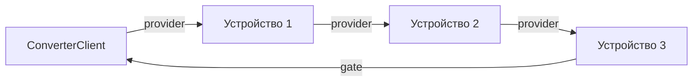
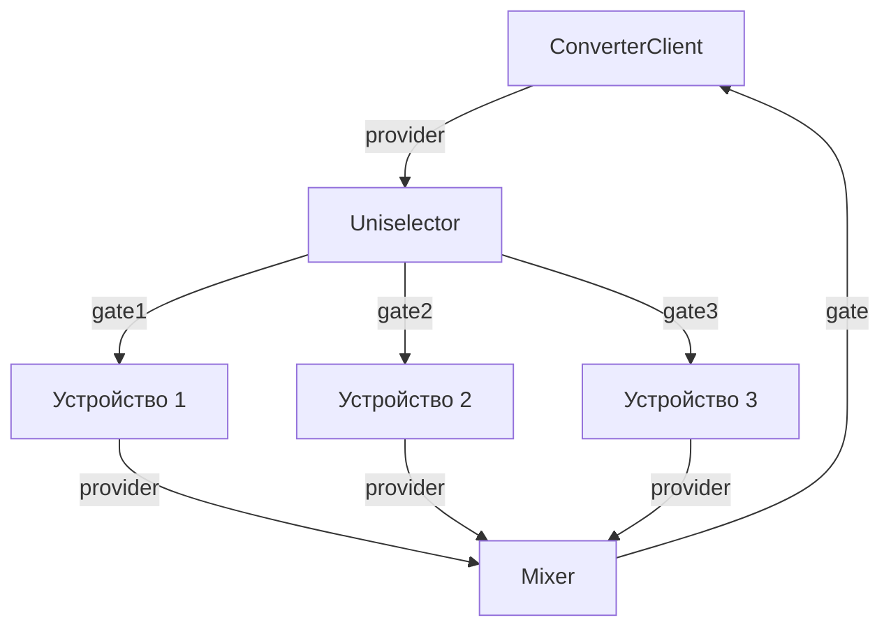

# ConverterClient - Устройство TCP-провайдера

**ConverterClient** используется, когда вам нужна связь с оборудованием работающим на преобразователях типа Ethernet <-> (serial,RS485,CAN). 

Вы можете найти примеры устройств которые работают с **ConverterClient** в наборах:

- vrack2-modbus - Набор устройств для упращенной работы с Modbus RTU устройствами
- vrack2-other-rtu - Набор устройств для работы с разными специфичными Modbus RTU устройствами. 

**ConverterClient** - не просто устройство, которое предоставляет доступ к преобразователю. Это достаточно сложное устройство, которое следит за соединениями, флагами, очередями и тп. Обеспечивая для вас как разработчика и как пользователя - максимально гибкие возможно для опроса ваших реальных устройств. 

## Организация связи

К примеру у вас есть 3 устройства ModbusRTU которое подключено к одному преобразователю интерфейсов типа Ethernet <-> RS485 и вы хотите использовать VRack2 что бы общаться с ними. 

Необходимо добавить **ConverterClient** и настроить у него параметры подключения, пример в сервис-файле:

```json
    {
        "id": "Provider",
        "type": "vrack2-net.ConverterClient",
        "options": {
            "socket": {
                "host": "192.168.1.200",
                "port": 4001
            },
            "debug": true
        }
    },
```

Особенность таких сетей заключается в том, что работать одновременно можно только с одним устройством на сети. Обычно протоколы этих сетей адресные, и позволяют выбрать с кем общаться по его индивидуальному адресу. 

Для того что бы решить эту проблему, каждое устройство VRack2 которое является абстракцией над реальным устройством - должно работать по очереди. 

Рассмотрим на премере. 

У нас есть 3 устройства для опроса 3х разных Modbus устройств, и все они находяться в одной сети за Ethernet <-> RS485 преобразователем:

 - Device1
 - Device2
 - Device3

Каждыйое из этих устройств должено:

 - Получить класс провайдера с помощью которого оно будет выполнять запросы
 - Выполнить нужную работу
 - Вернуть класс провайдера

Обычно у таких устройств есть 2 порта - вход `provider` и выход `provider`.

Внутри устройства обычно это обрабатывается так:

```ts
/**
   * Обработчик входа `provider`
   * При получении провайдера - мы получаем контроль
   * Это наша основная точка входа для работы с устройством
  */
  async inputProvider(provider: TCPProvider) {
    // Сохраняем себе провайдера
    this.Provider = provider 
    // Устанавливаем текущее устройство, которое занимает провайдер
    this.Provider.setDevice(this.type, this.id) 
    try {
      await this.update() // Выполнение наших запросов
      // Установка флага что все прошло успешно и устройство как бы онлайн
      this.shares.online = true 
    } catch (err) {
      // Опрос не удался - считаем что устройство offline
      this.shares.online = false
      this.error('Update device error', err as Error) // Сообщаем об ошибке
    }
    this.Provider.clearDevice() // Очищаем устройство провайдера
    this.ports.output.provider.push(this.Provider) // ОБЯЗАТЕЛЬНО отдаем провайдера
    this.render() // отправка shares данных
  }
```

Такой код гарантирует что устройство вернет контроль следующему устройству или обратно **ConverterClient**. При условии что все подключено правильно. Давайте разберемся вначале как подключаются такие устройства.

## Типы построения схем опроса

### Последовательная схема

Наиболее простая схема, где каждое устройство передает провайдер следующему в цепочке:

ConverterClient -> device1 -> device2 -> device3 -> ConverterClient

Для корректного отображения схем лучше использовать [репозиторий](https://github.com/VRack2/vrack2-net/blob/main/ConverterClient.md)



**Пример соединений:**

```json
"connections": [
    "ConverterClient.provider -> device1.provider",
    "device1.provider -> device2.provider", 
    "device2.provider -> device3.provider",
    "device3.gate -> ConverterClient.gate"
]
```

Хоть такая схема и рабочая - она имеет некоторые недостатки и не рекомендуется для использования на постоянной основе. 

### Параллельная схема с использованием Uniselector

Более надежная схема, где управление возвращается к ConverterClient после каждого устройства:

```
ConverterClient -> Uniselector  -> Device1 -> Mixer -> ConverterClient
                                -> Device2 -> Mixer -> ConverterClient
                                -> Device3 -> Mixer -> ConverterClient
```



**Пример соединений:**

```json
"connections": [
    "ConverterClient.provider -> Uniselector.gate",
    "Uniselector.gate1 -> device1.provider",
    "Uniselector.gate2 -> device2.provider",
    "Uniselector.gate3 -> device3.provider",
    "device1.provider -> Mixer.mix1",
    "device2.provider -> Mixer.mix2", 
    "device3.provider -> Mixer.mix3",
    "Mixer.gate -> ConverterClient.gate"
]
```

Это более типичная и более правильная схема, поскольку каждое устройство возвращает управление обратно **ConverterClient**.

Почему это важно? Дело в том, что внутри **ConverterClient** есть несколько важных инструментов и флагов. Например, если связь с преобразователем пропадет во время опроса Device1 - Device1 вернет управление сразу же **ConverterClient** после чего он будет ждать восстановления связи с преобразователем не выдавая управление никому. 

Но в этой схеме необходимо, что бы количество подключенных устройств соответсвовало количеству выходных портов `vrack2-basic.Uniselector`. В противном случае, если портов будет больше чем устройств, при достижении неподключенного порта - управлением провайдером повиснет и больше никто не сможет ничего опрашивать.

-------------------------------

ВАЖНО ЧТО БЫ УПРАВЛЕНИЕ ВСЕГДА ВОЗВРАЩАЛОСЬ В **ConverterClient**

------------------------------ 

## Работа с классом провайдера

### Состояние провайдера
```javascript
this.inputProvider(provider) {
    console.log(provider.state)
}
```

**Свойства состояния:**
- `counter` *number* - Общее количество успешных запросов
- `timeout` *boolean* - Флаг таймаута соединения
- `connected` *boolean* - Активно ли подключение к серверу
- `progress` *boolean* - Выполняется ли запрос в данный момент
- `connection` *boolean* - Выполняется ли попытка подключения
- `errors` *number* - Количество завершившихся ошибкой запросов
- `byteSend` *number* - Количество отправленных байт
- `byteReceive` *number* - Количество полученных байт
- `device` *string* - Активное устройство которое сейчас заняло провайдер
- `deviceType` *string* - Тип активного устройства
- `urgentQueue` *Array<string>* - Активная срочная очреедь

### Работа с провайдером

#### Проверка ответа

Что бы общаться с устройством, нужно отправить запрос и получить ответ. В сетях типа RS485 это происходит так:

  1. Отправляем запрос
  2. Ждем timeout времени в ожидании ответа
  3. Если мы что то получили - нам нужно определить - то ли это
     1. Если ответ соответсвует нашему формату - считаем что пакет ответа получен успешно и обрабатываем его
     2. Если ответ не соответсвует - ждем до timeout - возможно нам придет еще часть ответа
  4. Если ничего не получили - считаем, что устройство offline

Для определения - получили ли мы полный пакет данных - нам нужно установить нашу собственную функцию проверки пакета. Обычно это делается при получении класса провайдера:

```javascript
provider.setPkgCheck((buffer) => {
    if (buffer.length < 5) return false;
    return buffer.readUInt8(1) === 0x10 && buffer.length === 8;
})
```

Наша функция должна вернуть `true` если пакет считается полным или `false` если вы ждете еще данные. 

Очень важно не делать дополнительные проверки в этой функции, такие как подсчет CRC и тп. Тут важна максимальная краткость, что вы получили с точки зрения вашего протокола - полный ответ. 

#### Выполнение запроса

После установки фукнции определения пакета - можно выполнять сам запрос. 

```js
await request(buffer, timeout)
```

 - `buffer` - `Buffer` байт которые будут записаны в сокет
 - `timeout` - Время в мс, в течении которого будет ожидаться ответ

В случае ошибки или выхода timeout будет выброшено исключение:

- `Provider is busy` - выполняется другой запрос
- `Provider not connected` - отсутствует соединение с сервером
- `Request timeout` - превышено время ожидания ответа

Если же запрос выполнился успешно и полученные данные соответсвуют пакету наших данных - ответ можно получить через `getBuffer()`

Обычно в `update` это выглядит как то так: 

```ts
  // Устанавливаем свою функцию проверки пакета
  this.Provider.setPkgCheck((data)=>{ return (data.length === 7) })

  // Очень важно - проверяем - можем ли мы производить запрос.
  // Бывает так что к этому моменту соединение провайдера с преобразователем
  // уже закрылось и нам просто незачем пытаться выполнять запрос
  // Нам необходимо вернуть управление обратно к ConverterClient
  if (!this.Provider.canRequest()) throw new Error('Provider not ready!')

  // Создаем буффер запроса
  const reqBuffer = this.makeSpecialRequest(1,0x01,0x01)
  // Выполняем запрос (обязательно await!!!)
  await this.Provider.request(reqBuffer, this.options.timeout)
  // Парсим ответ согласно своему протоколу
  const result = this.parseSpecialRequest(this.Provider.getBuffer())
```

Иногда может быть полезно попытаться выполнить несколько одинаковых запросов не получая ошибки `Request timeout`. Для этого можно использовать:

```ts
// Где count - количество попыток запроса
await this.Provider.autoRequest(buffer, timeout, count = 3)
```

Рекомендуется использовать именно `autoRequest`

## Срочная очередь

Может так случиться, что устройству срочно нужно выполнить запрос. Например пришел экшен который должен немедленно поменять накую то настройку. Вы можете ускорить получение провайдера конкретным устройством поставив его в строчную очередь. 

```ts
    actionSetDO(data: { port: number, value: number }){
        // Добавляем список изменений которые нам нужно сделать когда мы 
        // получим управление провайдером
        this.shares.writeDO.push(data)
        // ставим себя в строчную очередь
        this.Provider.addUrgentQueue(this.id)
    }
```

В таком случае, когда любое другое устройство попытается вызвать проверку:

```ts
if (!this.Provider.canRequest()) throw new Error('Provider not ready!')
```

Произойдет исключение - потому что в срочной очереди есть устройство! Каждое последующее устройство будет моментально передавать упарвление провайдером, пока не дойдет до устройства, которое установило себя в очередь. 

Вся эта схема будет работать только в случае если:

 - Вызываете `this.Provider.setDevice(this.type, this.id)`
 - Очищаете `this.Provider.clearDevice()`
 - Проверяете `if (!this.Provider.canRequest()) throw new Error('Provider not ready!')`

## Критически важные напоминания!

1. **Схема должна быть цикличной** - управление всегда возвращается к ConverterClient
2. **Инициатор действий - провайдер** - вся активность начинается от ConverterClient
3. **Обязательная отправка сигнала завершения** - даже при ошибках
4. **Использование await** - для корректной работы асинхронных запросов
